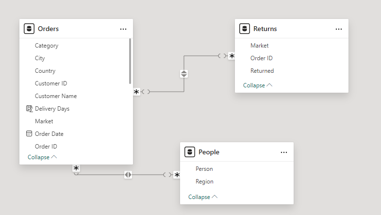
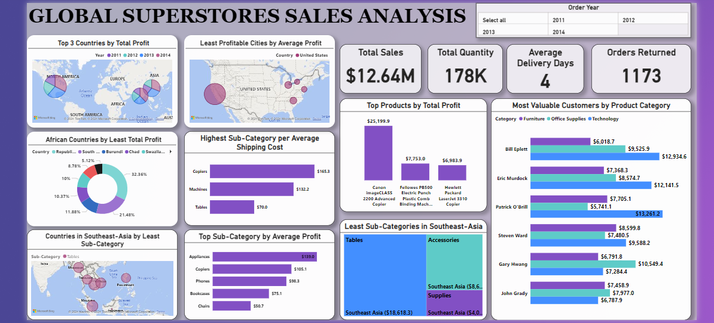

# Global-Superstores-Sales-Analysis

## Introduction
This dataset was gotten from a 3-month data analysis cohort (DigitaleyDrive) I participated in. It was interesting working on this data as it offered me the opportunity to practice my skills.

## Power BI Concepts Applied
- Data Modeling Star Schema (Many : *)
- Applied filters

## Problem Statement
- What are the three countries with the highest total profit in 2014?
- For each of these three countries, find the three products with the highest total profit.
- Identify the 3 subcategories with the highest average shipping cost in the United States.
- Assess Nigeria’s profitability for 2014 and comparison with other African countries?
- What factors might be responsible for Nigeria’s poor performance?
- Identify the product subcategory that is the least profitable in Southeast Asia.
- Is there a specific country in Southeast Asia where Global Superstore should stop offering the least subcategory identified?
- Which city is the least profitable in the United States?
- Which product subcategory has the highest average profit in Australia?
- Who are the most valuable customers products they purchase?

## Skills Demonstrated

Data cleaning, modeling, visualization

## Data Sourcing
Saved the link shared in the cohort group as an excel file and imported into power BI for analysis.

It contains three sheets:

1. ORDERS with 51,2901 rows and 24 columns
2. PEOPLE with 14 rows and 2 columns
3. RETURNS with 1174 rows and 3 columns

## Data Transformation
Data was cleaned and transformed with the Power Query Editor of Power BI 

- Making first row as headers in the PEOPLE and RETURNS tables
- Created a measure to calculate average delivery days i.e Delivery days = [Shipped date] - [Order Date]
- Changed datatypes of ID's to text to avoid summing up of values during visualization.
- Removed all duplicates

## Data Modeling
Power BI automatically connected related tables resulting in a star schema model. The ORDER table is the fact table and the RETURNS and PEOPLE are the dimensional tables; connected to the ORDER table via 'Order ID' and 'Region' respectively.

## Data Analysis and Visualization

## Insights
- United States, India and China were the most profitable countries in 2014 with Canon imageCLASS 2200 Advanced Copier being the Best-seller product of all three countries.
- It is interesting to note that Copiers might just be a highly requested products as it ranks as one of the highest item per shipping cost with sum of 105.3k dollars.
- Nigeria ranks the fifth highest country per shipping cost yet has very low profit. This is as a result of discount rates.
- Least Sub-Category in South Asia include Tables, Accessories and Supplies.
- The sales of Tables should be discontinued as there is a decline in sales.
- In Australia, Appliances takes the lead in sales with a total of $139 average profit.
- The Top 6 Customers are Bill Eplett, Eric Murdock, Patrick O'Brill, Steven Ward, Gary Hwang and John Grady, they purchase more of technology and office supplies as compared to furnitures.

